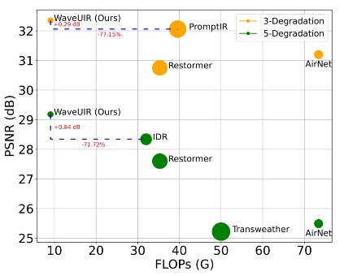
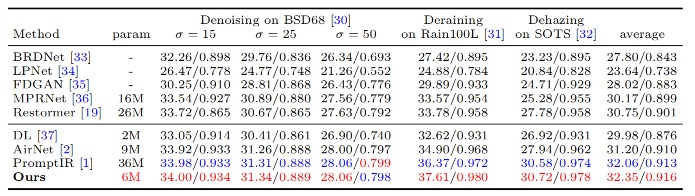
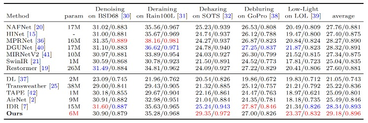

# WaveUIR: Wavelet-based Guided Transformer Model for Efficient Universal Image Restoration

[Zhidong Zhu](https://scholar.google.com/citations?user=gMoJbSsAAAAJ&hl=zh-CN), Bangshu Xiong, [Zhibo Rao](https://scholar.google.com/citations?user=36YvjLAAAAAJ&hl=zh-CN), Jinhao Zhu, [Wenchao Li](https://scholar.google.com/citations?hl=zh-CN&user=ph9tt1oAAAAJ), Qiaofeng Ou, [Xing Li](https://scholar.google.com/citations?user=8IcXm6AAAAAJ&hl=zh-CN)

The paper is currently under review.

## Model Performance Comparison
 

## Data Download and Preparation

All the datasets used in the paper can be downloaded from the following locations:

Denoising: [BSD400](https://drive.google.com/file/d/1idKFDkAHJGAFDn1OyXZxsTbOSBx9GS8N/view?usp=sharing), [WED](https://drive.google.com/file/d/1e62XGdi5c6IbvkZ70LFq0KLRhFvih7US/view?usp=sharing), [Urban100](https://drive.google.com/drive/folders/1B3DJGQKB6eNdwuQIhdskA64qUuVKLZ9u), [Kodak24](https://r0k.us/graphics/kodak/), [BSD68](https://github.com/clausmichele/CBSD68-dataset/tree/master/CBSD68/original)

Deraining: [Train100L&Rain100L](https://drive.google.com/drive/folders/1-_Tw-LHJF4vh8fpogKgZx1EQ9MhsJI_f?usp=sharing)

Dehazing: Train[RESIDE](https://sites.google.com/view/reside-dehaze-datasets/reside-%CE%B2), Test [SOTS-Outdoor](https://sites.google.com/view/reside-dehaze-datasets/reside-v0)

Deblur: [GoPro](https://drive.google.com/file/d/1y_wQ5G5B65HS_mdIjxKYTcnRys_AGh5v/view?usp=sharing)

Enhance: [LOL-V1](https://daooshee.github.io/BMVC2018website/)

The training data should be placed in ``` data/Train/{task_name}``` directory where ```task_name``` can be Denoise, Derain, Dehaze, Deblur, or Enhance.

The testing data should be placed in the ```test``` directory wherein each task has a seperate directory. 

The training and test datasets are organized as:


```
    |--data   
    |    |--Train
    |    |    |--Deblur
    |    |    |    |--blur
    |    |    |    |    |--GOPR0372_07_00_000047.png
    |    |    |    |    |--GOPR0372_07_00_000048.png
    |    |    |    |     ...
    |    |    |    |--sharp
    |    |    |    |    |--GOPR0372_07_00_000047.png
    |    |    |    |    |--GOPR0372_07_00_000048.png
    |    |    |    |     ...
    |    |    |--Dehaze
    |    |    |    |--original
    |    |    |    |    |--0025.png
    |    |    |    |    |--0039.png
    |    |    |    |     ...
    |    |    |    |--synthetic
    |    |    |    |    |--part1
    |    |    |    |    |    |--0025_0.8_0.1.jpg
    |    |    |    |    |    |--0025_0.8_0.2.jpg
    |    |    |    |    |    ...
    |    |    |    |    |--part2
    |    |    |    |    |    |--3068_0.8_0.1.jpg
    |    |    |    |    |    |--3068_0.8_0.2.jpg
    |    |    |    |    |    ...    
    |    |    |    |    |--part3
    |    |    |    |    |    |--5425_0.8_0.1.jpg
    |    |    |    |    |    |--5425_0.8_0.2.jpg
    |    |    |    |    |    ...   
    |    |    |    |    |--part4
    |    |    |    |    |    |--6823_0.8_0.1.jpg
    |    |    |    |    |    |--6823_0.8_0.2.jpg
    |    |    |    |    |    ...
    |    |    |--Denoise
    |    |    |    |--00001.bmp
    |    |    |    |--00001.bmp
    |    |    |    ...
    |    |    |    |--5096.jpg
    |    |    |    |--6046.jpg
    |    |    |    ...
    |    |    |--Derain
    |    |    |    |--gt
    |    |    |    |    |--norain-1.png
    |    |    |    |    |--norain-2.png
    |    |    |    |     ...
    |    |    |    |--rainy
    |    |    |    |    |--rain-1.png
    |    |    |    |    |--rain-2.png
    |    |    |    |     ...
    |    |    |--Enhance
    |    |    |    |--gt
    |    |    |    |    |--2.png
    |    |    |    |    |--5.png
    |    |    |    |     ...
    |    |    |    |--low
    |    |    |    |    |--2.png
    |    |    |    |    |--5.png
    |    |    |    |     ...
    |    |--test
    |    |    |--deblur
    |    |    |    |--gopro
    |    |    |    |    |--input
    |    |    |    |    |   |--GOPR0384_11_00_000001.png
    |    |    |    |    |   |--GOPR0384_11_00_000002.png
    |    |    |    |    |   ...
    |    |    |    |    |--target
    |    |    |    |    |   |--GOPR0384_11_00_000001.png
    |    |    |    |    |   |--GOPR0384_11_00_000002.png
    |    |    |    |    |   ...
    |    |    |--dehaze
    |    |    |    |--input
    |    |    |    |    |--0001_0.8_0.2.jpg
    |    |    |    |    |--0002_0.8_0.08.jpg
    |    |    |    |    ...
    |    |    |    |--target
    |    |    |    |   |--0001.png
    |    |    |    |   |--0002.png
    |    |    |    |   ...
    |    |    |--denoise
    |    |    |    |--bsd68
    |    |    |    |    |--3096.jpg
    |    |    |    |    |--12084.jpg
    |    |    |    |    ...
    |    |    |    |--urban100
    |    |    |    |    |--img_001.png
    |    |    |    |    |--img_002.png
    |    |    |    |    ...
    |    |    |    |--kodak24
    |    |    |    |    |--kodim01.png
    |    |    |    |    |--kodim02.png
    |    |    |    |    ...
    |    |    |--derain
    |    |    |    |--Rain100L
    |    |    |    |    |--input
    |    |    |    |    |   |--1.png
    |    |    |    |    |   |--2.png
    |    |    |    |    |   ...
    |    |    |    |    |--target
    |    |    |    |    |   |--1.png
    |    |    |    |    |   |--2.png
    |    |    |    |    |   ...
    |    |    |--enhance
    |    |    |    |--lol
    |    |    |    |    |--input
    |    |    |    |    |   |--1.png
    |    |    |    |    |   |--22.png
    |    |    |    |    |   ...
    |    |    |    |    |--target
    |    |    |    |    |   |--1.png
    |    |    |    |    |   |--22.png
    |    |    |    |    |   ...
```

## Environment Installation

1. Clone our repository
```
git clone https://github.com/Archaic-Atom/WaveUIR.git
cd WaveUIR
```

2. Create conda environment
The Conda environment used can be recreated using the env.yml file
```
conda env create -f env.yml
```

## Training

After preparing the training data in ```data/``` directory, use 
```
python train.py
```
to start the training of the model. Use the ```de_type``` argument to choose the combination of degradation types to train on. By default it is set to all the 5 degradation tasks (denoising, deraining, dehazing, deblurring, enhancement).

Example Usage: If we only want to train on deraining and dehazing:
```
python train.py --de_type derain dehaze
```

## Testing

After preparing the testing data in ```test/``` directory, place the mode checkpoint file in the ```ckpt``` directory. The pre-trained model can be downloaded [here](https://drive.google.com/drive/folders/19RbxEEEEIKEddudFbIgWYKh3j7PVsdKS). To perform the evaluation, use
```
python test.py --mode {n}
```
```n``` is a number that can be used to set the tasks to be evaluated on, 0 for denoising, 1 for deraining, 2 for dehazing, 3 for deblurring, 4 for enhancement, 5 for three-degradation all-in-one setting and 6 for five-degradation all-in-one setting.

Example Usage: To test on all the degradation types at once, run:

```
python test.py --mode 6
```

## Results
Performance results of the WaveUIR framework trained under the all-in-one setting.

<details>
<summary><strong>Three Distinct Degradations</strong> (click to expand) </summary>

 
</details>
<details>
<summary><strong>Five Distinct Degradations</strong> (click to expand) </summary>

 
</details><br>

The visual results can be downloaded [here](https://drive.google.com/drive/folders/1CELko-F95W_reox7KzM8HqEip675bABB).

## Citation

## Contact
Should you have any questions, please contact zhidongzhu@buaa.edu.cn

**Acknowledgment:** This code is based on the [PromptIR](https://github.com/va1shn9v/PromptIR) repository.